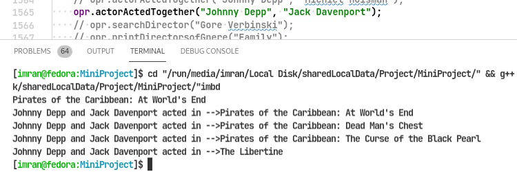
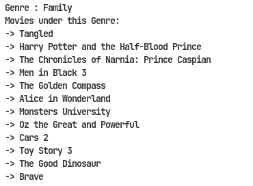
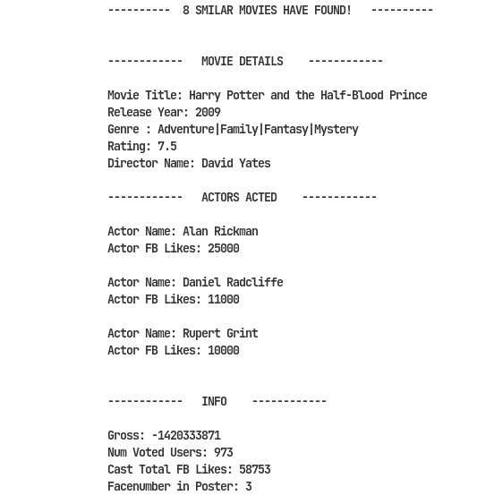
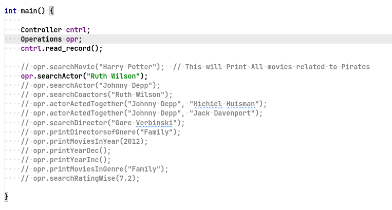
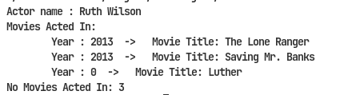

# Parse IMDB Movies
## Description

The program will parse all the data related the movies in **IMDB_Top5000-SEECS.csv** file and save the data in apropriate data strcuture. Now the user can do simple operation on the data and extract the information like "in which movies tom cruise acted" 
or "in which movie two specific actors were co-actors"
<br>


<br>
or "movies that fall under the genre of family".
<br>


<br>
or you can simply search a movie
<br>



## Getting Started

### Dependencies

* C++
* LINUX
* Vscode (optional)

### Installing

* Clone the repo 
```
https://github.com/imranzaheer612/imdbMoviesParser.git
```

* Then simply run the **imdb.cpp**

### Executing program

You can simple use a IDE like vscode or can enter the command yourself.
```
g++ imbd.cpp -o imbd
./imdb
```

The UI of the program is not implement yet but you can test run the cases. These are some sample testa cases you can edit it.



Edit the **main** according to your choice then run the program.




## License

This project is licensed under the MIT License - see the LICENSE.md file for details
